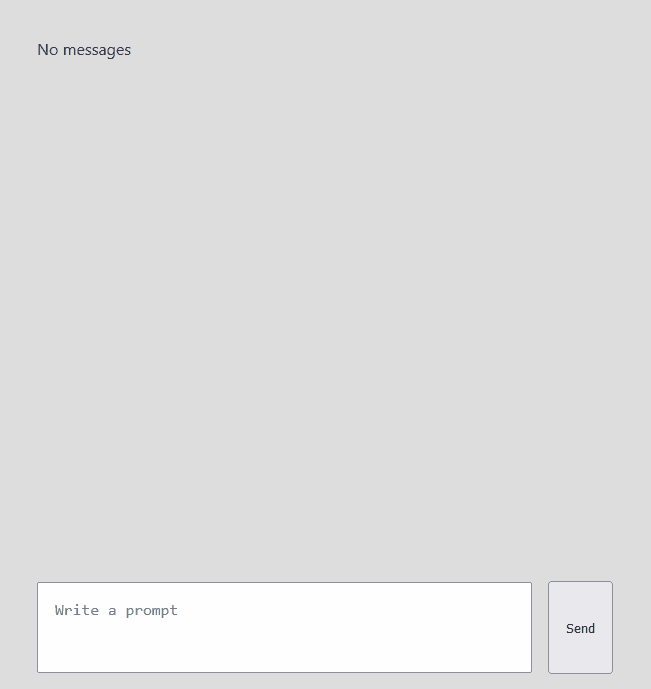

# OpenAI Streaming Hooks

> Talk directly to [OpenAI Completion APIs](https://platform.openai.com/docs/api-reference/chat) and stream the response back in real-time in the browser--no server required.

Provides [custom React Hooks](https://react.dev/learn/reusing-logic-with-custom-hooks) capable of calling OpenAI Completions APIs with [streaming support](https://github.com/openai/openai-cookbook/blob/main/examples/How_to_stream_completions.ipynb) enabled by [Server-Sent Events (SSE)](https://developer.mozilla.org/en-US/docs/Web/API/Server-sent_events/Using_server-sent_events).

## Example



[Example code here](https://github.com/jonrhall/openai-streaming-hooks/blob/main/example/example.tsx)

## Use

1. Install the OpenAI Streaming Hooks library:
```bash
npm install --save openai-streaming-hooks@https://github.com/jonrhall/openai-streaming-hooks
```
2. Import the hook and use it:
```tsx
import { useChatCompletion, GPT35 } from 'openai-streaming-hooks';

const Component = () => {
  const [messages, submitMessage] = useChatCompletion({
    model: GPT35.TURBO,
    apiKey: 'your-api-key',
  });
  ...
};
```

## Supported Types of Completions

There are two main types of completions available from OpenAI that are supported here:

1. [Text Completions](https://platform.openai.com/docs/guides/completion), which includes models like `text-davinci-003`.
2. [Chat Completions](https://platform.openai.com/docs/guides/chat), which includes models like `gpt-4` and `gpt-3.5-turbo`.

There are some pretty big fundamental differences in the way these models are supported on the API side. Chat Completions consider the context of previous messages when making the next completion. Text Completions only consider the context passed into the explicit message it is currently answering.

The custom React Hooks in this library try to normalize this behavior by returning the same tuple structure of `[messages, submitMessage]` to the React component regardless of the type of Completion used.

The structure of a message object inside of `messages` differs based on the type of Completion.

### Chat Completions

An individual message in a Chat Completion's `messages` list looks like:
```ts
interface ChatMessage {
  content: string;                // The content of the completion
  role: string;                   // The role of the person/AI in the message
  timestamp: number;              // The timestamp of when the completion finished
  meta: {
    loading: boolean;             // If the completion is still being executed
    responseTime: string;         // The total elapsed time the completion took
    chunks: ChatMessageToken[];   // The chunks returned as a part of streaming the execution of the completion
  };
}
```

Each chunk corresponds to a token streamed back to the client in the completion. A `ChatMessageToken` is the base incremental shape that content in the stream returned from the OpenAI API looks like:

```ts
interface ChatMessageToken {
  content: string;    // The partial content, if any, received in the chunk
  role: string;       // The role, if any, received in the chunk
  timestamp: number;  // The time the chunk was received
}
```


When the `submitMessage` function is called two new chat messages are appended to the `messages` state variable:

1. The first is the message that you just submitted with a `role` of type `User`
2. The second is the message that content will be streamed into in real-time as the OpenAI completion executes.